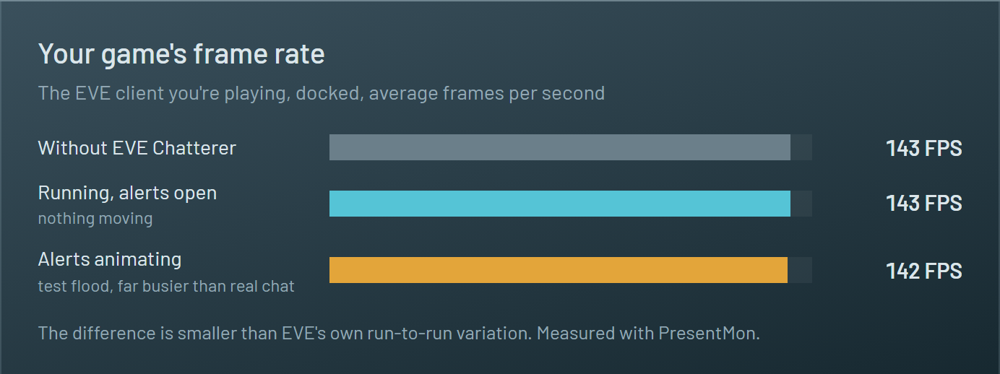
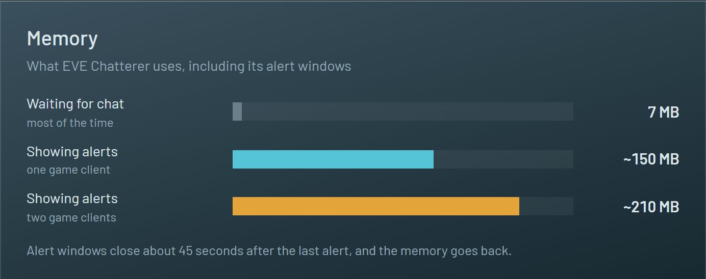
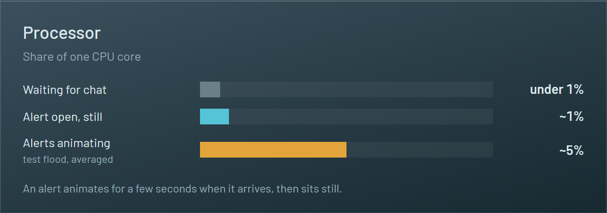

# Will it slow down my game?

No. EVE Chatterer was measured on a real setup (two EVE clients on two monitors, Windows 11), and the client you're playing runs the same with it as without it.

## Frame rate

Alerts are small windows drawn over the game by Windows itself; EVE doesn't render them and doesn't know they're there. The graphics card barely notices them.

The one place a small effect showed up: a *background* client, one EVE has already slowed down because you're not looking at it, dipped a little while a flood of test alerts animated for a full minute. Real alerts animate for a few seconds.

## Memory

Most of the time EVE Chatterer is just watching the chat log files and uses about 7 MB. The alert windows are built with Microsoft Edge's WebView2 (already part of Windows), which is what the extra memory while showing alerts is for. They close about 45 seconds after the last alert, and the memory is given back.

## Processor

Checking the chat logs twice a second costs almost nothing. The only noticeable work is the few seconds an alert slides in and glows.

---

Measured 2026-09-30 with release builds: frame rates with Intel's [PresentMon](https://github.com/GameTechDev/PresentMon), memory and processor across the app's whole process tree. The details and method are in [docs/FINDINGS.md](docs/FINDINGS.md) (sections 8 and 15).
