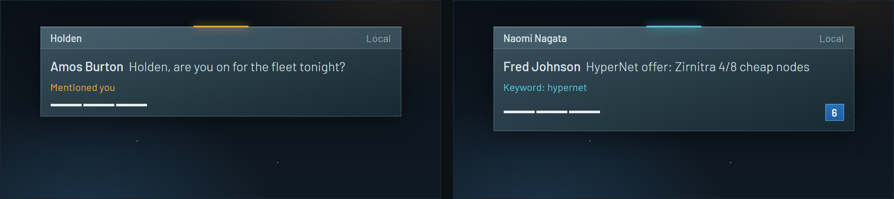
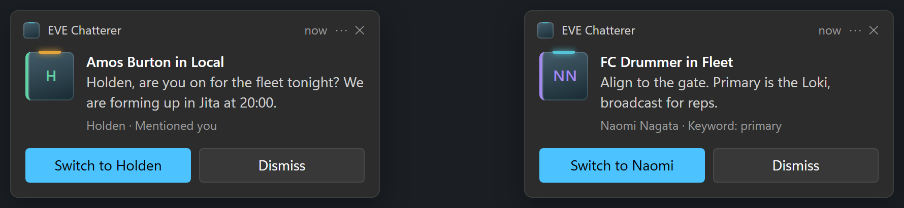
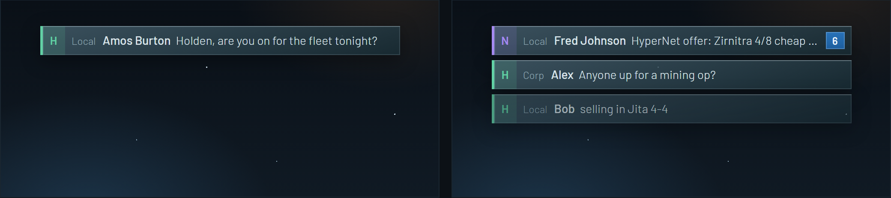
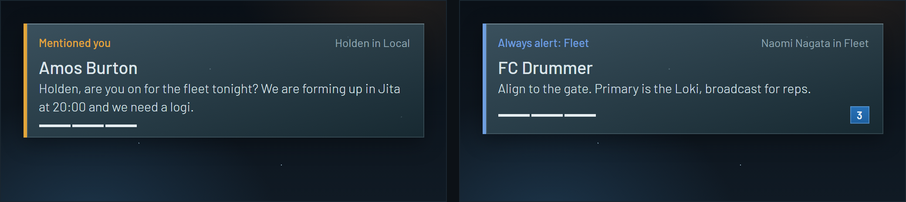
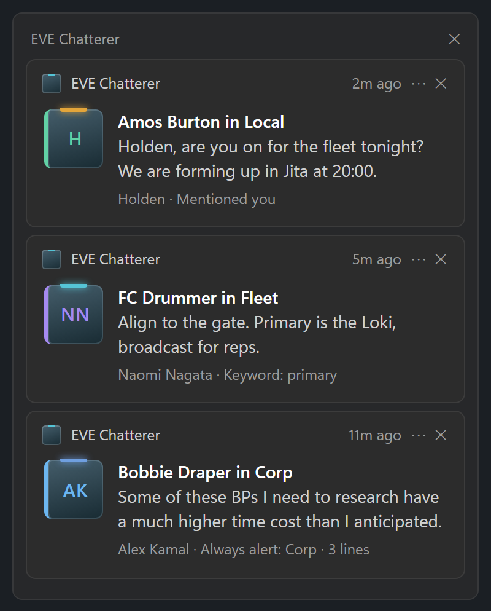

# EVE Chatterer

**Never miss the chat that matters in EVE Online, on any of your characters.**

EVE Chatterer watches your EVE chat logs and tells you when something needs your attention: someone says your name, your fleet or corp is talking, a keyword you care about shows up, or a particular pilot says anything at all. It works across every character you run at once, and it shows each alert in the right place:

- **In the game**, as a small alert over that character's EVE window.
- **In Windows**, as a notification with a "Switch to" button when you're in another app, and in Action Center for anything you missed.
- **As a sound**, if you want one.

It's a small app that sits in your system tray and stays out of the way.





<sub>Concept images from the design mockups; the real alerts match them closely.</sub>

---

## Is it safe to use?

EVE Chatterer only **reads the chat log files** EVE writes to your Documents folder. That's all it ever looks at.

- It never touches the EVE client: no injection, no memory reading, no hooks into the game.
- It never sends anything to EVE, and it never types or clicks for you.
- It never changes, moves or deletes your logs.
- It doesn't connect to anything except GitHub, to check for updates of itself.

Its alerts are ordinary windows that sit over the game and can't be clicked or focused, so they never steal your mouse or keyboard.

---

## Getting started

### 1. Install

Download **`EVE.Chatterer_…_x64-setup.exe`** from the [latest release](https://github.com/seraphx2/eve-chatterer/releases/latest) and run it.

- It installs just for your Windows user. No administrator rights are needed.
- It starts with Windows from then on. You can turn that off in **Settings > General**.
- It keeps itself up to date (see [Updates](#updates)).

> Prefer not to install? Download the **portable** zip instead, unzip it anywhere and run `eve-chatterer-app.exe`. The portable copy works the same but won't update itself or start with Windows.

> Windows may say it "protected your PC" the first time, because the app isn't code-signed by a paid certificate. Click **More info > Run anyway**.

### 2. Turn on chat logging in EVE

EVE only writes chat logs if you ask it to. In the game, press **Esc** to open the settings and tick **Log chat to file**. If you play several accounts, check it on each one.

If EVE Chatterer sees a character playing without a chat log, it will remind you with a notification.

### 3. Play

That's it. Log in, and each character appears in the app automatically. Out of the box:

| Channel | You're alerted for |
|---|---|
| Private conversations | Every message |
| Fleet, Corp, Alliance | Every message (limited to a few a minute so a busy channel can't flood you) |
| Local and public channels | Only when someone mentions your character, or a tracked word shows up (such as `@all`) |

Alerts are skipped for the character whose window you're looking at, since you can already see its chat. Your other characters still alert.

Open **Settings** any time by clicking the tray icon.

---

## Alerts in the game

Each character's alerts appear over **its own EVE window**, inside the game area. They follow the window when you move it, hide when you minimize it, and stay on its virtual desktop.

There are three styles, which you can choose per channel:

**Panel**: sender, message and why it alerted. The usual choice. The blue badge counts repeat lines folded into one alert.


**Strip**: one compact line. Good for busy channels.



**Beacon**: larger and more noticeable, and it stays longer. Used for private messages by default.



### Moving and resizing

Press **Ctrl + Alt + O** while playing. A sample alert appears on the character you're looking at: drag it where you want it, and drag its edge to make it wider or narrower. Press **Ctrl + Alt + O** again to save. Each character remembers its own position, and **Settings > (character) > reset to default** puts it back.

---

## Alerts in Windows

When you aren't in the game (you're in a browser, in Discord, or your EVE windows are minimized), alerts come as Windows notifications instead, styled to match.

- **Switch to** brings that character's EVE window to the front.
- Notifications follow the overlay style: Strips go quickly, Panels stay a while, Beacons stay until you dismiss them. **A mention of your name always stays** until you deal with it.
- Several lines from the same channel update one notification with a count, instead of stacking up.
- They respect Windows **Do Not Disturb** and **Focus**, and anything you miss waits in Action Center.




---

## Sounds

Sound is off until you want it. To turn it on:

1. In **Settings**, tick **Sound** on the channels that should make a noise (on **Defaults** for all characters, or on one character).
2. In **Settings > Audio**, choose:
   - **No sound**: silent everywhere, whatever the channels say.
   - **One sound for every character**: the built-in alert tone, or any `.wav`, `.mp3`, `.ogg` or `.flac` file you pick.
   - **A different sound per character**: so you can tell who's being called without looking.

Only one sound plays at a time, and after a sound there's a **quiet time** (10 seconds by default) before the next one, so a busy fleet makes one sound, not a hundred. **Mentions of your name always play**, straight through the quiet time. Volume and the quiet time are on the same page.

---

## Settings

Click the tray icon to open Settings. Everything saves as you change it; there's no Save button.

**Defaults** sets how every character behaves. Each **character** page shows the same settings, and anything you change there applies to that character only. Anything you haven't changed keeps following Defaults, including later changes to Defaults. A small dot marks a setting you've changed, and **↺ use default** undoes it.

For each channel you can set:

- **Mode**: everything, mentions and tracked words only, or nothing.
- **Style**: Strip, Panel or Beacon.
- **Rate cap**: the most alerts a minute before the rest are folded into a count.
- **Sound**: on or off.
- **Suppress**: when to stay quiet. **When client is focused** (the default), **When client is visible**, or **Never**.

Also on each page:

- **Tracked words**: extra words or patterns to watch for, in every channel or only some. The ones on Defaults apply to every character too.
- **Always alert / Ignore**: pilots to always hear from, or never hear from, whatever the channel settings say. A character can override a Defaults entry for a name, including setting it back to normal.

---

## Updates

Installed copies check for updates by themselves every few hours. When one is ready, you'll get a notification, and the tray menu gets an **Install update** item. You can also check and install from **Settings > About**. Updating takes a few seconds and restarts the app; your settings are kept.

Updates come only from this project's GitHub releases and are cryptographically signed, so the app won't install anything else.

---

## Troubleshooting

**No alerts at all.**
Check that **Log chat to file** is on in EVE (step 2 above). Then check the channel's **Mode** in Settings: Local and public channels only alert on mentions and tracked words by default.

**No alert for the character I'm playing.**
That's intended: the character you're looking at can already see its chat. Change **Suppress** to **Never** on that channel if you want alerts anyway. (Your own messages never alert.)

**Notifications don't appear.**
Check Windows **Do Not Disturb** / **Focus** and **Settings > System > Notifications > EVE Chatterer**.

**My documents are on OneDrive.**
That's fine; EVE Chatterer finds your real Documents folder wherever it is.

**How do I uninstall?**
**Windows Settings > Apps > Installed apps > EVE Chatterer > Uninstall.** It removes the app, its Start Menu entry and its start-with-Windows entry. Your settings stay in `%APPDATA%\io.github.seraphx2.evechatterer` in case you reinstall; delete that folder to remove them too.

---

## Building from source

For developers. You'll need Windows, [Rust](https://rustup.rs) and [Node.js](https://nodejs.org) 22 or newer.

```sh
cd app
npm install
npm run tauri dev
```

`cargo test --workspace` runs the tests. Design notes and measurements live in [`docs/`](docs/), and [`CLAUDE.md`](CLAUDE.md) has the full development guide, including test flags.

Changes go to the `dev` branch; merging `dev` into `main` publishes a release automatically.

---

## License

[MIT](LICENSE). EVE Online and all related names are trademarks of CCP hf. This project isn't affiliated with or endorsed by CCP.
